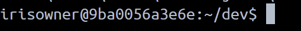
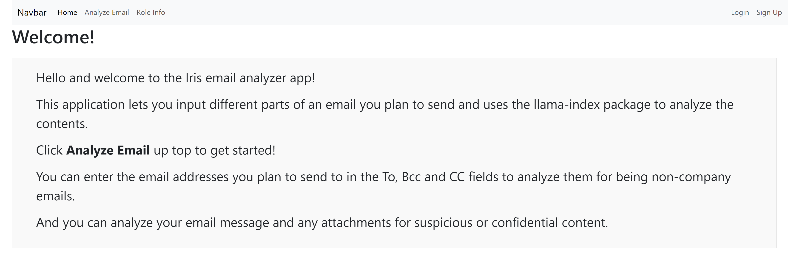
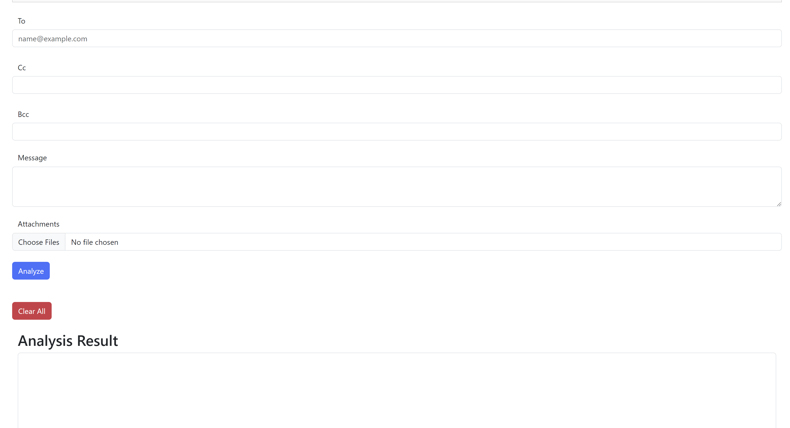

# Iris Email Analyzer

## Demo Video

Please click [here](https://youtu.be/-6TNTlR3zHs) to watch a short demo and explanation of the app.

Along with a [quick YouTube short](https://youtube.com/shorts/eLJy9tIMdfI?si=pQvfM4B5Dq25pMrR) showing one analysis example.

## Functionality
This is a flask application that implements a significant portion of [this community idea](https://ideas.intersystems.com/ideas/DPI-I-473) about flagging suspicious or confidential content in an outgoing email using Generative AI. This application uses functionality from the Python llama-index library.

On the top nav bar if you click **Analyze Email** you will see a form that allows you to enter common information from an outgoing email such as the message body, uploading attachments (for the sake of the analysis it only supports text based file types for this release), and To, CC and BCC fields for email addresses.

llama-index asks the proper questions of whether email addresses seem like they're non-company related or suspicious emails, and it screens all attachments and the message body for confidential or suspicious content.

There is also a page called **Role Info** which currently does not play a large part in the functionality at this time but it is there in case there are later enhancements to implement restrictions based on user roles.

The app also has the ability to sign up new users and log in. User information is stored in an IRIS database.

## Installing and Running the Application as a Docker Image

- Switch to the directory or folder you want this repo to be cloned into and run this clone command.

```
git clone https://github.com/ericmariasis/iris-email-analyzer-app.git
```

- Then switch into the root directory of the repo.

```
cd iris-email-analyzer-app
```

- On Docker desktop or any other terminal where you have access to Docker commands, run the below command to build the docker compose file.

```
docker compose build
```

- Once that is finished run the docker compose.

```
docker compose up -d
```

### Preparing to run the app

If you want to run the core part of the app properly, you will need to use a valid OpenAI API key. The llama-index package is used and needs the token to function properly. However, the application gracefully deals with the absence of a token by reporting the result as either `You do not have an API token` if you don't have any and it reports an invalid token as well.

To get an OpenAI API key if you don't already have one, go to [this page](https://platform.openai.com/docs/quickstart/step-2-set-up-your-api-key) to learn how to get one.

Once you have an OpenAI API key, go to [this file](python/myconfig.py), python/myconfig.py in your local repo clone and update the value of `OPENAI_API_KEY` to the value of your key.

### Run the app

Run the below command, again in a terminal with Docker access, to run an iris shell.

```
docker compose exec iris bash
```
Once you run that, you should see a bash shell that looks something like this.



Then run

```
irispython app.py
```

to run the app locally.

When it kicks off, at the bottom of the output you should see a series of `Running on` statements. Click any of them to open the app's homepage in a browser.

## App Navigation

The home page upon opening the app looks something like this.



The analyze email page has a form that looks like below where all fields are optional and they are analyzed if they are filled in upon pressing the Analyze button, and the results are shown in the Analysis Results read only box at the bottom.



## Database with SQLAlchemy-Iris

The table to store user info created on signup is called **user**.

To look at the table in Iris while the app is running, navigate to [http://localhost:55038/csp/sys/exp/%25CSP.UI.Portal.SQL.Home.zen?$NAMESPACE=USER&](http://localhost:55038/csp/sys/exp/%25CSP.UI.Portal.SQL.Home.zen?$NAMESPACE=USER&)
